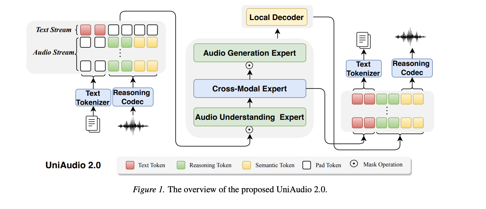

# 
 UniAudio 2.0: A Unified Audio Language Model with Text-Aligned Factorized Audio Tokenization 

 Code and Checkpoints will be released in [code](https://github.com/yangdongchao/UniAudio2) 

## Introduction

We study two foundational problems in audio language models: (1) how to design an audio tokenizer that can serve as an intermediate representation for both understanding and generation; and (2) how to build an audio foundation model that generalizes in few-shot and zero-shot settings, analogous to large text language models.
To this end, we make two contributions.
First, we propose ReasoningCodec, a discrete audio codec that factorizes audio into (i) reasoning tokens, which encode text-aligned, high-level analysis and planning representations for audio understanding and hierarchical generation, and (ii) reconstruction tokens, which encode semantic-rich acoustic cues for high-fidelity waveform reconstruction. This design yields understanding performance comparable to strong continuous representations while improving generation quality and reconstruction fidelity over prior discrete tokenizers.
Second, we introduce a unified autoregressive architecture for text and audio, together with multi-stage training and multi-task data construction. Using this framework, we train UniAudio 2.0 on 100B text tokens and 60B audio tokens.
Across a wide range of speech, sound, and music tasks, UniAudio 2.0 performs competitively on in-domain evaluations and demonstrates strong few-shot and zero-shot generalization to unseen tasks. Demo, Code and checkpoints will be available at \href{https://uniaudio2.github.io/demo/}{https://uniaudio2.github.io/demo/}.

The overview of UniAudio 2.0 as following picture shows.

In the following, we give the demo for each tasks.

## Audio Codec Tokenizer Reconstruction Comparison

| 
 Ground Truth 
 | 
 Encodec 
 | 
 higgs-audio 
 | 
 Mimi-codec 
 | 
 XCodec 
 | 
 Ours 
 |
| ----------- | ------ | ------ | ------ | ------ | ------ |
| <audio class="audio-player2" src="reconstruction/speech/gt/p225_001.wav" controls preload></audio> | <audio class="audio-player2" src="reconstruction/speech/encodec/p225_001.wav" controls preload></audio> | <audio class="audio-player2" src="reconstruction/speech/higging/p225_001.wav" controls preload></audio> | <audio class="audio-player2" src="reconstruction/speech/mimi/p225_001.wav" controls preload></audio> | <audio class="audio-player2" src="reconstruction/speech/xcodec/p225_001.wav" controls preload></audio> | <audio class="audio-player2" src="reconstruction/speech/ours/p225_001.wav" controls preload></audio> |
| <audio class="audio-player2" src="reconstruction/speech/gt/p225_002.wav" controls preload></audio> | <audio class="audio-player2" src="reconstruction/speech/encodec/p225_002.wav" controls preload></audio> | <audio class="audio-player2" src="reconstruction/speech/higging/p225_002.wav" controls preload></audio> | <audio class="audio-player2" src="reconstruction/speech/mimi/p225_002.wav" controls preload></audio> | <audio class="audio-player2" src="reconstruction/speech/xcodec/p225_002.wav" controls preload></audio> | <audio class="audio-player2" src="reconstruction/speech/ours/p225_002.wav" controls preload></audio> |
| <audio class="audio-player2" src="reconstruction/music/gt/-0Gj8-vB1q4_30.0_40.0.wav" controls preload></audio> | <audio class="audio-player2" src="reconstruction/music/encodec/-0Gj8-vB1q4_30.0_40.0.wav" controls preload></audio> | <audio class="audio-player2" src="reconstruction/music/higging/-0Gj8-vB1q4_30.0_40.0.wav" controls preload></audio> | <audio class="audio-player2" src="reconstruction/music/mimi/-0Gj8-vB1q4_30.0_40.0.wav" controls preload></audio> | <audio class="audio-player2" src="reconstruction/music/xcodec/-0Gj8-vB1q4_30.0_40.0.wav" controls preload></audio> | <audio class="audio-player2" src="reconstruction/music/ours/-0Gj8-vB1q4_30.0_40.0.wav" controls preload></audio> |
| <audio class="audio-player2" src="reconstruction/music/gt/-0SdAVK79lg_30.0_40.0.wav" controls preload></audio> | <audio class="audio-player2" src="reconstruction/music/encodec/-0SdAVK79lg_30.0_40.0.wav" controls preload></audio> | <audio class="audio-player2" src="reconstruction/music/higging/-0SdAVK79lg_30.0_40.0.wav" controls preload></audio> | <audio class="audio-player2" src="reconstruction/music/mimi/-0SdAVK79lg_30.0_40.0.wav" controls preload></audio> | <audio class="audio-player2" src="reconstruction/music/xcodec/-0SdAVK79lg_30.0_40.0.wav" controls preload></audio> | <audio class="audio-player2" src="reconstruction/music/ours/-0SdAVK79lg_30.0_40.0.wav" controls preload></audio> |
| <audio class="audio-player2" src="reconstruction/music/gt/-4NLarMj4xU_30.0_40.0.wav" controls preload></audio> | <audio class="audio-player2" src="reconstruction/music/encodec/-4NLarMj4xU_30.0_40.0.wav" controls preload></audio> | <audio class="audio-player2" src="reconstruction/music/higging/-4NLarMj4xU_30.0_40.0.wav" controls preload></audio> | <audio class="audio-player2" src="reconstruction/music/mimi/-4NLarMj4xU_30.0_40.0.wav" controls preload></audio> | <audio class="audio-player2" src="reconstruction/music/xcodec/-4NLarMj4xU_30.0_40.0.wav" controls preload></audio> | <audio class="audio-player2" src="reconstruction/music/ours/-4NLarMj4xU_30.0_40.0.wav" controls preload></audio> |

## TTS Demo

### Text-to-Speech (English)

| 
 Content 
 | 
 Qwen2.5-omni 
 | 
 Mimo-audio 
 | 
 Ours 
 |
| ----------------------- | ----------- | ------ | ------ |
| he began a confused complaint against the wizard who had vanished behind the curtain on the left | <audio class="audio-player2" src="TTS/EN/qwen/61-70968-0000.wav" controls preload></audio> | <audio class="audio-player2" src="TTS/EN/mimo/61-70968-0000.wav" controls preload></audio> | <audio class="audio-player2" src="TTS/EN/ours/61-70968-0000.wav" controls preload></audio> |
| give not so earnest a mind to these mummeries child | <audio class="audio-player2" src="TTS/EN/qwen/61-70968-0001.wav" controls preload></audio> | <audio class="audio-player2" src="TTS/EN/mimo/61-70968-0001.wav" controls preload></audio> | <audio class="audio-player2" src="TTS/EN/ours/61-70968-0001.wav" controls preload></audio> |
| a golden fortune and a happy life | <audio class="audio-player2" src="TTS/EN/qwen/61-70968-0002.wav" controls preload></audio> | <audio class="audio-player2" src="TTS/EN/mimo/61-70968-0002.wav" controls preload></audio> | <audio class="audio-player2" src="TTS/EN/ours/61-70968-0002.wav" controls preload></audio> |

### Text-to-Speech (Chinese)

| 
 Content 
 | 
 Qwen2.5-omni 
 | 
 Mimo-audio 
 | 
 Ours 
 |
| ----------------------- | ----------- | ------ | ------ |
| 通过创新技术让未来出行更加安全，高效。 | <audio class="audio-player2" src="TTS/ZH/qwen/00000309-00000009.wav" controls preload></audio> | <audio class="audio-player2" src="TTS/ZH/mimo/00000309-00000009.wav" controls preload></audio> | <audio class="audio-player2" src="TTS/ZH/ours/00000309-00000009.wav" controls preload></audio> |
| 全球每年有超过一百三十五万人，因交通事故而死亡。 | <audio class="audio-player2" src="TTS/ZH/qwen/00000309-00000039.wav" controls preload></audio> | <audio class="audio-player2" src="TTS/ZH/mimo/00000309-00000039.wav" controls preload></audio> | <audio class="audio-player2" src="TTS/ZH/ours/00000309-00000039.wav" controls preload></audio> |
| 拿一只中型平底锅，用中大火融化奶油，加入面粉搅拌至滑顺。 | <audio class="audio-player2" src="TTS/ZH/qwen/00004501-00000111.wav" controls preload></audio> | <audio class="audio-player2" src="TTS/ZH/mimo/00004501-00000111.wav" controls preload></audio> | <audio class="audio-player2" src="TTS/ZH/ours/00004501-00000111.wav" controls preload></audio> |

### Text-to-Speech (Yue / 粤语)

| 
 Content 
 | 
 Qwen2.5-omni 
 | 
 Ours 
 |
| ----------------------- | ----------- | ------ |
| 以上为转载 | <audio class="audio-player2" src="TTS/Yue/qwen/common_voice_yue_31190824-common_voice_yue_31190839.wav" controls preload></audio> | <audio class="audio-player2" src="TTS/Yue/ours/common_voice_yue_31190824-common_voice_yue_31190839.wav" controls preload></audio> |
| 人来人往 | <audio class="audio-player2" src="TTS/Yue/qwen/common_voice_yue_31190824-common_voice_yue_31190840.wav" controls preload></audio> | <audio class="audio-player2" src="TTS/Yue/ours/common_voice_yue_31190824-common_voice_yue_31190840.wav" controls preload></audio> |
| 同色至有得倾 | <audio class="audio-player2" src="TTS/Yue/qwen/common_voice_yue_31192011-common_voice_yue_31192012.wav" controls preload></audio> | <audio class="audio-player2" src="TTS/Yue/ours/common_voice_yue_31192011-common_voice_yue_31192012.wav" controls preload></audio> |
| 你哋查唔查到呢个字 | <audio class="audio-player2" src="TTS/Yue/qwen/common_voice_yue_31192011-common_voice_yue_31192013.wav" controls preload></audio> | <audio class="audio-player2" src="TTS/Yue/ours/common_voice_yue_31192011-common_voice_yue_31192013.wav" controls preload></audio> |
| 不如自己谂办法 | <audio class="audio-player2" src="TTS/Yue/qwen/common_voice_yue_31204888-common_voice_yue_31204889.wav" controls preload></audio> | <audio class="audio-player2" src="TTS/Yue/ours/common_voice_yue_31204888-common_voice_yue_31204889.wav" controls preload></audio> |

## Text-to-Sound Demo

Text-to-sound generation: given a text description (caption), the model generates the corresponding sound. Below are samples from our model (Ours).

| 
 Description 
 | 
 Ours 
 |
| ----------------------- | ----------- |
| A large crowd cheers and applauds | <audio class="audio-player2" src="sound/rqfQRErjfk8.wav" controls preload></audio> |
| A race car approaches quickly and slows down squealing tires | <audio class="audio-player2" src="sound/sEprKHm8Sj8.wav" controls preload></audio> |
| A man speaks as a vehicle engine idles | <audio class="audio-player2" src="sound/shmR4OZtzqA.wav" controls preload></audio> |

## Text-to-Music Demo

Text-to-music generation: given a text description (caption), the model generates the corresponding music. Below are samples from our model (Ours).

| 
 Description 
 | 
 Ours 
 |
| ----------------------- | ----------- |
| A male vocalist sings this energetic Punjabi folk song. The tempo is medium fast with an infectious tabla and Dhol percussive beat, ektara rhythm and a funky keyboard accompaniment. The song is lively, spirited, cheerful, simple, happy, playful, enthusiastic, vivacious with a festive, celebratory vibe and dance groove. This song is a Festive Punjabi Folk song. | <audio class="audio-player2" src="music/2wFjBoreaY.wav" controls preload></audio> |
| A male singer sings Arabic vocals with backup singers in vocal harmony. The song is medium tempo with a steady drumming rhythm, percussive bass line, keyboard accompaniment and percussive hits. The song is an Arabic dance song. | <audio class="audio-player2" src="music/8OIugVSFeE.wav" controls preload></audio> |
| This is a classical music waltz piece played on a glass harp instrument. The melody is being played on the smaller glasses at a higher pitch while the rhythm is being played on the bigger glass at a medium pitch. The piece is being played at a cathedral which gives a nice resonance and natural reverb effect. The piece has a unique character. It can be played in the soundtracks of children's movies/TV shows. | <audio class="audio-player2" src="music/b-7P-XsnUI.wav" controls preload></audio> |

## Song Generation Demo

Song generation: given lyrics (text), the model generates the corresponding singing. Below are samples from our model (Ours).

### Song Generation (English)

| 
 Lyrics 
 | 
 Ours 
 |
| ----------------------- | ----------- |
| Long time ago in Bethlehem, so the Holy Bible says, | <audio class="audio-player2" src="song/EN/[-tpq_bzSKes]-[10-20].wav" controls preload></audio> |
| One day long time but it's over now. | <audio class="audio-player2" src="song/EN/[0cNYPgD6cEA]-[30-40].wav" controls preload></audio> |
| The truth is I haven't got a clue. One thing you know where I'm going. | <audio class="audio-player2" src="song/EN/[0TiEO149Ydc]-[30-40].wav" controls preload></audio> |
| Buffalo's happening now, we're on the move now The bills are happening now, they're making it happen now We've got the spirit, a lot of spirit, yeah | <audio class="audio-player2" src="song/EN/[1JpeDWbgUO8]-[30-40].wav" controls preload></audio> |
| If I tell the world I'll never say enough Cause it was not said to you And that's exactly what I want | <audio class="audio-player2" src="song/EN/[1RhYdQnZ_hw]-[30-40].wav" controls preload></audio> |

### Song Generation (Chinese)

| 
 Lyrics 
 | 
 Ours 
 |
| ----------------------- | ----------- |
| 爱与不爱, 是最痛苦的徘徊, 表面不爱, 但心里仍期待, Hello, 我想你 | <audio class="audio-player2" src="song/ZH/91_357_segment_1.wav" controls preload></audio> |
| 我的眼光闪烁闪烁好空洞, 我的心跳扑通扑通地阵阵悸动. | <audio class="audio-player2" src="song/ZH/91_358_segment_6.wav" controls preload></audio> |

## InstructTTS Demo

InstructTTS: given an **instruction** (style/caption) and **content** (text), the model generates speech that follows the instruction. Below are samples comparing Mimi and Ours.

### InstructTTS (English)

| 
 Instruction (Style) 
 | 
 Content (Text) 
 | 
 Mimo-audio 
 | 
 Ours 
 |
| ----------------------- | ----------- | ------ | ------ |
| A young adult female, brimming with enthusiasm, expresses her thoughts animatedly, her words punctuated by subtle pauses. Her slightly low-pitch voice carries a melodious tone, resonating with the passion in her words. | Help, oh help.What kind of help?Speak man?What means that?Bloody knifetis hot, it smokes. | <audio class="audio-player2" src="InsturctTTS/EN/mimo/7122_6430_000023.wav" controls preload></audio> | <audio class="audio-player2" src="InsturctTTS/EN/ours/7122_6430_000023.wav" controls preload></audio> |
| A middle-aged man, his voice rich with emotion and animated expressions. | On november sixteen twenty sixteen, catherine vargas, an executive assistant to kushner, received a request for a meeting with russian ambassador sergey kislyak. | <audio class="audio-player2" src="InsturctTTS/EN/mimo/2221_13983_000004.wav" controls preload></audio> | <audio class="audio-player2" src="InsturctTTS/EN/ours/2221_13983_000004.wav" controls preload></audio> |

### InstructTTS (Chinese)

| 
 Instruction (Style) 
 | 
 Content (Text) 
 | 
 Mimo-audio 
 | 
 Ours 
 |
| ----------------------- | ----------- | ------ | ------ |
| 语气中充满了悲伤痛苦，声音较小传递了悲痛欲绝的情绪  | 能一直选择面对,选择用尽办法来挽救我们的婚姻,我能怪他什么啊。 | <audio class="audio-player2" src="InsturctTTS/ZH/mimo/tx_xiao_0200107001042.wav" controls preload></audio> | <audio class="audio-player2" src="InsturctTTS/ZH/ours/tx_xiao_0200107001042.wav" controls preload></audio> |
| 悲伤逆流成河 | 一年又一年,一日复一日,一聚一离别,一生一场梦。 | <audio class="audio-player2" src="InsturctTTS/ZH/mimo/tx_emotion_00201000015.wav" controls preload></audio> | <audio class="audio-player2" src="InsturctTTS/ZH/ours/tx_emotion_00201000015.wav" controls preload></audio> |
| 内心对他人感到抱歉，责怪自己 | 抱歉让你认识一个这么差劲的我。 | <audio class="audio-player2" src="InsturctTTS/ZH/mimo/tx_emotion_00201000209.wav" controls preload></audio> | <audio class="audio-player2" src="InsturctTTS/ZH/ours/tx_emotion_00201000209.wav" controls preload></audio> |

## Audio-Instructed TTS (zero-shot)

Given an **audio prompt** (voice timbre), a **caption** (style description), and **speech content** (text), the model generates speech that follows the prompt voice and style. The test data of Chinese TTS come from https://github.com/thuhcsi/SECap

### Audio-Instructed TTS (English)

| 
 Content (Text) 
 | 
 Caption (Style) 
 | 
 Prompt (Voice) 
 | 
 Ours 
 |
| ----------------------- | ----------- | ------ | ------ |
| In early december twenty sixteen dmitriev again broached the topic of meeting incoming administration officials with nader in january or february. | With a moderate pace, a middle-aged woman's voice carries an air of genuine enthusiasm. Her tone is strikingly expressive and animated. | <audio class="audio-player2" src="audio_instruct_tts/EN/prompt/2221_13983_000000.flac" controls preload></audio> | <audio class="audio-player2" src="audio_instruct_tts/EN/2221_13983_000000.wav" controls preload></audio> |
| The security council, which includes russia, was scheduled to vote on the resolution the following day.There was speculation in the media that the obama administration would not oppose the resolution. | In the midst of her speech, a middle-aged woman moderates her tone, exhibiting a slight yet animated expression. | <audio class="audio-player2" src="audio_instruct_tts/EN/prompt/2221_13983_000006.flac" controls preload></audio> | <audio class="audio-player2" src="audio_instruct_tts/EN/2221_13983_000006.wav" controls preload></audio> |

### Audio-Instructed TTS (Chinese)

| 
 Content (Text) 
 | 
 Caption (Style) 
 | 
 Prompt (Voice) 
 | 
 Ours 
 |
| ----------------------- | ----------- | ------ | ------ |
| 人生就像剥洋葱,总有一片会让你流泪。 | 伤心难过，声音颤抖，情绪激动失望 | <audio class="audio-player2" src="audio_instruct_tts/ZH/prompt/tx_emotion_00201000107.wav" controls preload></audio> | <audio class="audio-player2" src="audio_instruct_tts/ZH/tx_emotion_00201000107.wav" controls preload></audio> |
| 心痛?要怪就怪自己,有本事爱上别人,没本事让别人爱上自己。 | 伤心难过，又无能为力 | <audio class="audio-player2" src="audio_instruct_tts/ZH/prompt/tx_emotion_00201000148.wav" controls preload></audio> | <audio class="audio-player2" src="audio_instruct_tts/ZH/tx_emotion_00201000148.wav" controls preload></audio> |
| 抱歉让你认识一个这么差劲的我。 | 内心对他人感到抱歉，责怪自己 | <audio class="audio-player2" src="audio_instruct_tts/ZH/prompt/tx_emotion_00201000209.wav" controls preload></audio> | <audio class="audio-player2" src="audio_instruct_tts/ZH/tx_emotion_00201000209.wav" controls preload></audio> |
| 他如果真的爱你,你就不会这么难过了。 | 伤心不已，悲伤凄凉 | <audio class="audio-player2" src="audio_instruct_tts/ZH/prompt/tx_emotion_00201000274.wav" controls preload></audio> | <audio class="audio-player2" src="audio_instruct_tts/ZH/tx_emotion_00201000274.wav" controls preload></audio> |

## Speech edit 

Speech edit: the user asks give a speech and a prompt to modify the speech; the model responds in speech. 

| 
 Sample ID 
 | 
 input speech 
 | 
 prompt 
 |
 Ours 
 |
| ----------------------- | ----------- | ------ | ------ |
| 1 | <audio class="audio-player2" src="speech_edit/input/speech_edit_4_1580_141084_000076_000006.wav" controls preload></audio> | edit the speech with whisper style | <audio class="audio-player2" src="speech_edit/ours/speech_edit_4_1580_141084_000076_000006.wav" controls preload></audio> |
| 2 | <audio class="audio-player2" src="speech_edit/input/AriaNeural_whispering_to_shouting.wav" controls preload></audio> | edit the speech with shouting style | <audio class="audio-player2" src="speech_edit/ours/AriaNeural_whispering_to_shouting.wav" controls preload></audio> |
| 3 | <audio class="audio-player2" src="speech_edit/input/speech_edit_task_000836_speed_slow.wav" controls preload></audio> | make the speech speaking slow | <audio class="audio-player2" src="speech_edit/ours/speech_edit_task_000836_speed_slow.wav" controls preload></audio> |
| 4 | <audio class="audio-player2" src="speech_edit/input/speech_edit_task_010405_speed_fast.wav" controls preload></audio> | make the speech speaking fast | <audio class="audio-player2" src="speech_edit/ours/speech_edit_task_010405_speed_fast.wav" controls preload></audio> |

## Dysarthric Speech Recognition (zero-shot)

Dysarthric speech recognition: given dysarthric (impaired) speech audio, the model recognizes the spoken content. Below are samples with ground truth transcription and our model's recognition result (Ours).

| 
 Audio 
 | 
 Ground Truth 
 | 
 Ours (Recognized) 
 |
| ----------------------- | ----------- | ------ |
| <audio class="audio-player2" src="DSR/F02_B1_C12_M8.wav" controls preload></audio> | Sentence | Sentence |
| <audio class="audio-player2" src="DSR/F04_B1_UW68_M2.wav" controls preload></audio> | dissatisfaction | dissatisfaction |
| <audio class="audio-player2" src="DSR/M16_B2_CW59_M3.wav" controls preload></audio> | so | so |

## Speech_Sound generation (zero-shot)

Speech-with-sound generation: given speech content (text) and a sound tag, the model generates audio that contains both the speech and the specified sound. Below are samples from our model (Ours).

| 
 Content (Speech) 
 | 
 Sound Tag 
 | 
 Ours 
 |
| ----------------------- | ----------- | ------ |
| but it's not the first occurrence of its charming kind that i know to have involved a child | gunshot_or_gunfire | <audio class="audio-player2" src="speech_sound/121_127105_000008_000001_01.wav" controls preload></audio> |
| it's in a locked drawer it has not been out for years | cello | <audio class="audio-player2" src="speech_sound/121_127105_000016_000004_01.wav" controls preload></audio> |
| somehow of all the days when the home feeling was the strongest this day it seemed as if she could bear it no longer | saxophone | <audio class="audio-player2" src="speech_sound/237_126133_000015_000001_01.wav" controls preload></audio> |
| oh she cried coming out of her rapture a little and springing over to mr king with phronsie still in her arms | acoustic_guitar | <audio class="audio-player2" src="speech_sound/237_126133_000031_000000_01.wav" controls preload></audio> |

## Speech-to-Text Question Answer (zero-shot)

Speech-to-text Q&A: the user asks a question in speech; the model responds in text. Below are samples with the question audio and our model's text answer (Ours).

| 
 Sample 
 | 
 Question (Speech) 
 | 
 Ours 
 |
| ----------------------- | ----------- | ------ |
| 1 | <audio class="audio-player2" src="s2t/question/helpful_base_0.wav" controls preload></audio> | Famous actors like Meryl Streep and Julia Roberts began their careers on Broadway, with Streep winning an Oscar for her performance in The Royal Family. |
| 2 | <audio class="audio-player2" src="s2t/question/helpful_base_1.wav" controls preload></audio> | The US states got their names from Native American languages, with some names being derived from local tribes or geographical features. |

## One-Shot Speech Denoising (few-shot)

One-shot speech denoising: given one demonstration pair (noisy source → clean target), the model denoises a query noisy clip. Below we show the demonstration (source and target), the query noisy audio, ground truth clean (GT), and outputs from Mimi and Ours.

| 
 Sample 
 | 
 Demo (Source) 
 | 
 Demo (Target) 
 | 
 Query 
 | 
 GT 
 | 
 Mimo-audio 
 | 
 Ours 
 |
| ----------------------- | ----------- | ----------- | ----------- | ------ | ------ | ------ |
| 1 | <audio class="audio-player2" src="few_shot_se/demo/source1/task_000001.wav" controls preload></audio> | <audio class="audio-player2" src="few_shot_se/demo/target1/task_000001.wav" controls preload></audio> | <audio class="audio-player2" src="few_shot_se/query_audio/task_000001.wav" controls preload></audio> | <audio class="audio-player2" src="few_shot_se/gt/task_000001.wav" controls preload></audio> | <audio class="audio-player2" src="few_shot_se/mimo/generation_one_shot_speech_denoising_few_shot_task_000001.wav" controls preload></audio> | <audio class="audio-player2" src="few_shot_se/ours/generation_one_shot_speech_denoising_few_shot_task_000001.wav" controls preload></audio> |
| 2 | <audio class="audio-player2" src="few_shot_se/demo/source1/task_000002.wav" controls preload></audio> | <audio class="audio-player2" src="few_shot_se/demo/target1/task_000002.wav" controls preload></audio> | <audio class="audio-player2" src="few_shot_se/query_audio/task_000002.wav" controls preload></audio> | <audio class="audio-player2" src="few_shot_se/gt/task_000002.wav" controls preload></audio> | <audio class="audio-player2" src="few_shot_se/mimo/generation_one_shot_speech_denoising_few_shot_task_000002.wav" controls preload></audio> | <audio class="audio-player2" src="few_shot_se/ours/generation_one_shot_speech_denoising_few_shot_task_000002.wav" controls preload></audio> |
| 3 | <audio class="audio-player2" src="few_shot_se/demo/source1/task_000004.wav" controls preload></audio> | <audio class="audio-player2" src="few_shot_se/demo/target1/task_000004.wav" controls preload></audio> | <audio class="audio-player2" src="few_shot_se/query_audio/task_000004.wav" controls preload></audio> | <audio class="audio-player2" src="few_shot_se/gt/task_000004.wav" controls preload></audio> | <audio class="audio-player2" src="few_shot_se/mimo/generation_one_shot_speech_denoising_few_shot_task_000004.wav" controls preload></audio> | <audio class="audio-player2" src="few_shot_se/ours/generation_one_shot_speech_denoising_few_shot_task_000004.wav" controls preload></audio> |

## One-Shot Voice Conversion (few-shot)

One-shot voice conversion: given one demonstration pair (source voice → target voice), the model converts the query speech to the target voice. Below we show the demonstration (source voice and target voice), the query speech to convert, ground truth (same content in target voice), and outputs from Mimi and Ours.

| 
 Sample 
 | 
 Demo (Source Voice) 
 | 
 Demo (Target Voice) 
 | 
 Query 
 | 
 GT 
 | 
 Mimo-audio 
 | 
 Ours 
 |
| ----------------------- | ----------- | ----------- | ----------- | ------ | ------ | ------ |
| 1 | <audio class="audio-player2" src="few_shot_vc/demo/source1/task_000007.wav" controls preload></audio> | <audio class="audio-player2" src="few_shot_vc/demo/target1/task_000007.wav" controls preload></audio> | <audio class="audio-player2" src="few_shot_vc/query_audio/task_000007.wav" controls preload></audio> | <audio class="audio-player2" src="few_shot_vc/gt/task_000007.wav" controls preload></audio> | <audio class="audio-player2" src="few_shot_vc/mimo/generation_one_shot_vc_few_shot_task_000007.wav" controls preload></audio> | <audio class="audio-player2" src="few_shot_vc/ours/generation_one_shot_vc_few_shot_task_000007.wav" controls preload></audio> |
| 2 | <audio class="audio-player2" src="few_shot_vc/demo/source1/task_000009.wav" controls preload></audio> | <audio class="audio-player2" src="few_shot_vc/demo/target1/task_000009.wav" controls preload></audio> | <audio class="audio-player2" src="few_shot_vc/query_audio/task_000009.wav" controls preload></audio> | <audio class="audio-player2" src="few_shot_vc/gt/task_000009.wav" controls preload></audio> | <audio class="audio-player2" src="few_shot_vc/mimo/generation_one_shot_vc_few_shot_task_000009.wav" controls preload></audio> | <audio class="audio-player2" src="few_shot_vc/ours/generation_one_shot_vc_few_shot_task_000009.wav" controls preload></audio> |
| 3 | <audio class="audio-player2" src="few_shot_vc/demo/source1/task_000011.wav" controls preload></audio> | <audio class="audio-player2" src="few_shot_vc/demo/target1/task_000011.wav" controls preload></audio> | <audio class="audio-player2" src="few_shot_vc/query_audio/task_000011.wav" controls preload></audio> | <audio class="audio-player2" src="few_shot_vc/gt/task_000011.wav" controls preload></audio> | <audio class="audio-player2" src="few_shot_vc/mimo/generation_one_shot_vc_few_shot_task_000011.wav" controls preload></audio> | <audio class="audio-player2" src="few_shot_vc/ours/generation_one_shot_vc_few_shot_task_000011.wav" controls preload></audio> |

## Few-Shot Sound Classification Demo

Few-shot (2-way) sound classification: given two support pairs (source1_audio → text_1, source2_audio → text_2) and a question that defines the two candidate classes, the model classifies the query audio. Below we show Question, Source1 (audio), Text1, Source2 (audio), Text2, Query (audio), Mimo-audio, Ours, and GT.

| 
 Sample 
 | 
 Question 
 | 
 Source1 (audio) 
 | 
 Text1 
 | 
 Source2 (audio) 
 | 
 Text2 
 | 
 Query (audio) 
 | 
 Mimo-audio 
 | 
 Ours 
 | 
 GT 
 |
| ----------------------- | ----------- | ----------- | ------ | ----------- | ------ | ----------- | ------ | ------ | ------ |
| 1 | For each of the following input output pairs, output is one of audio scene: [hand_saw or airplane] | <audio class="audio-player2" src="few_shot_sound/demo/source1/00359.wav" controls preload></audio> | airplane | <audio class="audio-player2" src="few_shot_sound/demo/source2/00359.wav" controls preload></audio> | hand_saw | <audio class="audio-player2" src="few_shot_sound/query_audio/00359.wav" controls preload></audio> | airplane | hand_saw | hand_saw |
| 2 | For each of the following input output pairs, output is one of audio scene: [toilet_flush or sneezing] | <audio class="audio-player2" src="few_shot_sound/demo/source1/00241.wav" controls preload></audio> | sneezing | <audio class="audio-player2" src="few_shot_sound/demo/source2/00241.wav" controls preload></audio> | toilet_flush | <audio class="audio-player2" src="few_shot_sound/query_audio/00241.wav" controls preload></audio> | sneezing | sneezing | sneezing |
| 3 | For each of the following input output pairs, output is one of audio scene: [frog or clock_tick] | <audio class="audio-player2" src="few_shot_sound/demo/source1/00255.wav" controls preload></audio> | frog | <audio class="audio-player2" src="few_shot_sound/demo/source2/00255.wav" controls preload></audio> | clock_tick | <audio class="audio-player2" src="few_shot_sound/query_audio/00255.wav" controls preload></audio> | frog | frog | frog |
| 4 | For each of the following input output pairs, output is one of audio scene: [mouse_click or cow] | <audio class="audio-player2" src="few_shot_sound/demo/source1/00427.wav" controls preload></audio> | mouse_click | <audio class="audio-player2" src="few_shot_sound/demo/source2/00427.wav" controls preload></audio> | cow | <audio class="audio-player2" src="few_shot_sound/query_audio/00427.wav" controls preload></audio> | mouse_click | cow | cow |
| 5 | For each of the following input output pairs, output is one of audio scene: [clapping or thunderstorm] | <audio class="audio-player2" src="few_shot_sound/demo/source1/00162.wav" controls preload></audio> | thunderstorm | <audio class="audio-player2" src="few_shot_sound/demo/source2/00162.wav" controls preload></audio> | clapping | <audio class="audio-player2" src="few_shot_sound/query_audio/00162.wav" controls preload></audio> | thunderstorm | thunderstorm | thunderstorm |

## Conclusion

In this study, we investigate how to build a unified audio foundation model that supports both understanding and generation. We propose ReasoningCodec, which factorizes audio into reasoning tokens and reconstruction tokens, and train UniAudio 2.0 with a unified autoregressive architecture and a multi-stage, multi-task training strategy. Experiments show strong performance on seen speech, sound, and music tasks, as well as encouraging few-shot and zero-shot generalization to unseen tasks. Extensive ablation studies suggest that scaling data/task diversity and model size is key to improving generalization on unseen tasks. In the future, we plan to scale both the model and the training data to further improve generalization. 

## Limitations

In this study, we focus on building a multi-task audio foundation model that supports diverse audio understanding and generation tasks. It can also generalize to many unseen tasks in few-shot or zero-shot settings. However, several limitations remain.

(1) To improve reconstruction quality for sound and music, we adopt a flow-based decoder to recover waveforms from semantic tokens. The multi-step decoding procedure in flow matching increases inference latency for generation. In the future, it is necessary to explore few-step decoding (e.g., two steps) to better balance quality and generation speed.

(2) Although UniAudio 2.0 demonstrates the ability to handle unseen tasks, there is still room for improvement. In addition, it has not yet been shown to solve arbitrary audio-related tasks. We acknowledge that the set of supported unseen tasks is closely related to the training data. For example, the model currently cannot handle speech diarization, likely because we do not include diarization- or duration-related supervision during training.  

(3) Due to limited GPU resources, we have not fully explored scaling behaviors (i.e., scaling laws) of UniAudio 2.0. We only conduct experiments on 1B- and 3B-parameter variants. In the future, scaling to 7B and larger models is a promising direction.

(4) Due to the relatively limited amount of sound and music data compared to speech data, UniAudio~2.0 currently performs better on speech-related tasks. In future work, expanding and improving sound and music datasets is expected to further enhance performance in these domains.

(5) This work primarily focuses on pre-training design choices, such as the audio tokenizer and the unified LLM architecture. As a result, we do not extensively investigate post-training strategies (e.g., multi-task SFT and reinforcement learning). We plan to incorporate more post-training techniques to further improve UniAudio 2.0.

(6) We acknowledge that the set of compared models is not exhaustive. This is partly because many related models are not publicly available, and partly because our framework supports a broad spectrum of tasks, which makes comprehensive comparisons challenging. We respect and appreciate all prior work in this area, even if some are not explicitly discussed due to space limitations. We also do not claim that UniAudio~2.0 universally outperforms all existing approaches; instead, different model architectures, different special task design (e.g. special models for TTS, ASR, diffusion-based unified models) also offer complementary strengths. 

